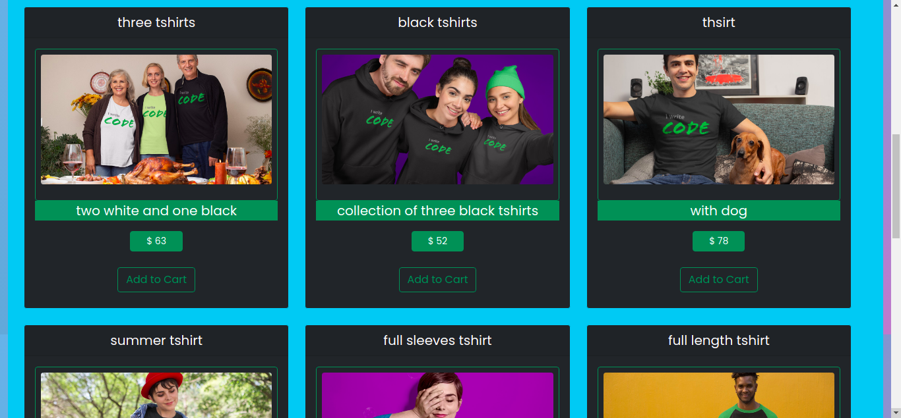

<h1 align="center">
🌐 MERN Stack
</h1>
<p align="center">
MongoDB, Expressjs, React, Nodejs
</p>

<p align="center">
   <a href="https://travis-ci.com/amazingandyyy/mern">
      
   </a>
   <a href="https://github.com/amazingandyyy/mern/blob/master/LICENSE">
      
   </a>
   <a href="https://circleci.com/gh/amazingandyyy/mern">
      
   </a>
</p>

### Deployment site
<a href="https://tshirtweb.herokuapp.com/" target="_blank">https://tshirtweb.herokuapp.com/</a>

`t-shirt` is a fullstack implementation in MongoDB, Expressjs, React/Redux, Nodejs.

## clone or download
```terminal
$ git clone https://github.com/sudhanshu1309/t-shirt.git
$ npm i
```

## project structure
```terminal
LICENSE
package.json
server/
   package.json
   .env (to create .env, check [prepare your secret session])
client/
   package.json
...
```

# Usage (run t-shirt app on your machine)

## Prerequisites
- [MongoDB](https://gist.github.com/nrollr/9f523ae17ecdbb50311980503409aeb3)
- [Node](https://nodejs.org/en/download/) ^14.0.0
- [npm](https://nodejs.org/en/download/package-manager/)

notice, you need client and server runs concurrently in different terminal session, in order to make them talk to each other

## Client-side usage(PORT: 3000)
```terminal
$ cd frontend   // go to client folder
$ npm i       // npm install packages
$ npm start // run it locally

// deployment for client app
$ npm run build // this will compile the react code using webpack and generate a folder called docs in the root level
$ npm run start // this will run the files in docs, this behavior is exactly the same how gh-pages will run your static site
```

## Server-side usage(PORT: 8000)

### Prepare your secret

run the script at the first level:

(You need to add a JWT_SECRET in .env to connect to MongoDB)


### Start

```terminal
$ cd backend   // go to server folder
$ npm i       // npm install packages
$ npm start // run it locally
```

# Dependencies(tech-stacks)
Client-side | Server-side
--- | ---
lodash: ^3.10.1 | cors: ^2.8.1
react: ^16.2.0 | dotenv: ^2.0.0
react-dom: ^16.2.0 | express: ^4.14.0
react-router-dom: ^4.2.2 | mongoose: ^4.7.4

# Screenshots of this project
<div>




</div>

## Standard

[](https://github.com/standard/standard)

## BUGs or comments

[Create new Issues](https://github.com/sudhanshu1309/t-shirt/issues) (preferred)

Email Me: sudhanshutripathi008@gmail.com (welcome, say hi)

## Author
[Sudhanshu Tripathi]

